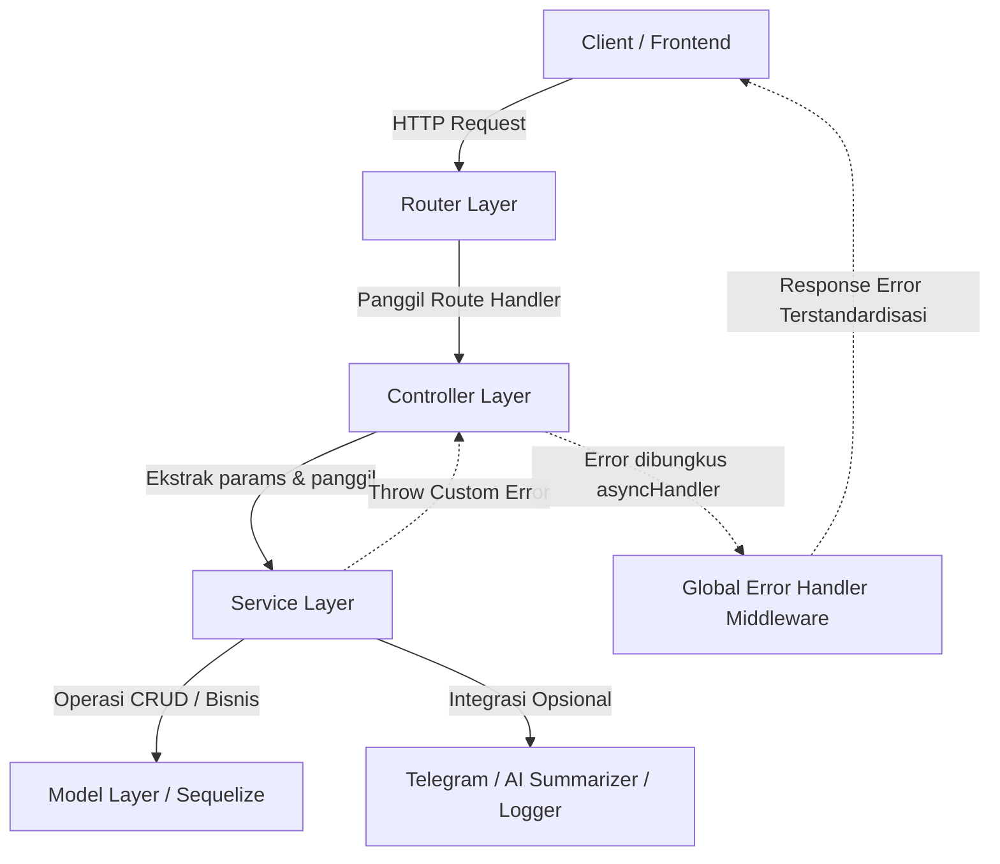

# Laporan Refactoring Arsitektur Backend (Senior Programmer Standards)

Saya telah menata ulang arsitektur proyek di `backend-news-js` agar sesuai dengan standar **Senior Programmer / Enterprise-Grade Express.js**. 

Di bawah ini adalah penjelasan mengenai apa yang salah dengan arsitektur sebelumnya, solusi pola desain (design patterns) baru yang diterapkan, serta panduan untuk menerapkan pola ini ke modul lainnya.

---

## 1. Analisis Masalah Arsitektur Lama (Junior/Mid Level)
Pada kode awal, sistem ini memiliki beberapa kelemahan arsitektur yang umum dijumpai pada proyek skala kecil yang sulit berkembang (*unscalable*):
1. **Fat Controllers (Controller Terlahu Gemuk)**: Controller langsung melakukan query database via Sequelize, memproses logika bisnis, mengirim notifikasi, dan mengolah data HTTP. Hal ini melanggar prinsip *Single Responsibility Principle (SRP)*.
2. **Duplikasi Boilerplate `try-catch`**: Setiap fungsi di controller dibungkus dalam blok `try-catch` yang sama untuk menangkap error, yang menyebabkan kode menjadi sangat panjang dan kotor.
3. **Penyatuan Logika Bisnis & Framework**: Logika bisnis (seperti penulisan notifikasi, integrasi Telegram, kalkulasi viralitas) menyatu dengan parameter HTTP Express (`req`, `res`). Ini membuat kode sulit diuji secara terpisah (*unit testing*).
4. **Format Error & Respon yang Tidak Konsisten**: Respon sukses dan error dibuat secara ad-hoc menggunakan `res.status().json()`, sehingga format respon antar API rentan tidak konsisten.

---

## 2. Blueprint Arsitektur Baru (Senior Programmer)
Untuk mengatasi masalah di atas, arsitektur backend diubah menjadi **Layered Architecture (Arsitektur Berlapis)** dengan pemisahan tanggung jawab (*Separation of Concerns*) yang jelas:



### Penjelasan Tanggung Jawab Tiap Layer:
1. **Router Layer (`src/routes/*`)**: Hanya memetakan URL endpoint ke fungsi controller yang sesuai dan memasang middleware (seperti autentikasi).
2. **Controller Layer (`src/controller/*`)**:
   - Menerima request HTTP.
   - Mengambil data dari `req.params`, `req.query`, dan `req.body`.
   - Memanggil fungsi yang sesuai di **Service Layer**.
   - Mengirim respon HTTP menggunakan utility response terpusat (`ok`, `created`, `paginated`).
   - *Tanpa try-catch, tanpa logika database, tanpa logika bisnis.*
3. **Service Layer (`src/services/*`)**:
   - Tempat tinggal **Logika Bisnis utama**.
   - Melakukan query ke database menggunakan Sequelize Model.
   - Melakukan integrasi pihak ketiga (Telegram, AI, caching).
   - Melempar error (*Throw error*) jika ada kegagalan bisnis (misalnya `NotFoundError`, `BadRequestError`).
   - *Sama sekali tidak tahu tentang Express (`req`, `res`), sehingga sangat mudah dibuatkan unit test-nya.*
4. **Utility & Shared Layer (`src/utils/*` & `src/shared/*`)**: Menyediakan helper pemformat respon, error kustom, log, dan utilitas lainnya.

---

## 3. Komponen Baru yang Diterapkan

### A. Centralized & Custom Error Classes (`src/utils/errors.js`)
Kita membuat kelas error kustom yang mewarisi `Error` bawaan JavaScript. Setiap kelas memiliki HTTP Status Code yang sesuai.
* **`BadRequestError` (400)**: Untuk input tidak valid.
* **`UnauthorizedError` (401)**: Untuk kegagalan autentikasi.
* **`ForbiddenError` (403)**: Untuk pembatasan hak akses (otorisasi).
* **`NotFoundError` (404)**: Untuk data yang tidak ditemukan.
* **`ConflictError` (409)**: Untuk konflik data (seperti email duplikat).

### B. Route Wrapper (`src/utils/asyncHandler.js`)
Fungsi pembungkus (*high-order function*) untuk mengeliminasi kode `try-catch` berulang. Jika promise gagal, error otomatis dilempar ke `next(error)` untuk ditangani global error handler.
```javascript
const asyncHandler = (fn) => (req, res, next) => {
  fn(req, res, next).catch(next);
};
```

### C. Enterprise Global Error Handler (`src/shared/middleware/errorHandler.js`)
Middleware terpusat Express untuk menangkap semua error:
* Menerjemahkan error database Sequelize (seperti error validasi `SequelizeValidationError` atau kolom unik `SequelizeUniqueConstraintError`) langsung menjadi **400 Bad Request** dengan pesan yang rapi.
* Menampilkan *stack trace* hanya pada env `development`.

### D. Flexible Pagination (`src/shared/http/response.js`)
Menyempurnakan fungsi `paginated` agar dapat menerima argumen `extra` (metadata tambahan seperti detail kategori) untuk digabungkan ke respon JSON secara otomatis.

---

## 4. Contoh Hasil Refactoring

### Perbandingan Controller Post (`src/controller/postController.js`)
* **Sebelum (654 baris)**: Penuh dengan query Sequelize, blok `try-catch` raksasa, generate slug manual, pemanggilan API AI manual, format error manual, dsb.
* **Sesudah (sangat bersih & deklaratif)**:
```javascript
const postService = require("../services/post.service");
const { ok, created, paginated, asyncHandler } = require("../utils");

exports.createPost = asyncHandler(async (req, res) => {
  const post = await postService.createPost(req.body, req.user);
  return created(res, post, "Post created successfully");
});

exports.getPostBySlug = asyncHandler(async (req, res) => {
  const { slug } = req.params;
  const post = await postService.getPostBySlug(slug);
  return ok(res, post, "Post retrieved successfully");
});
```

Seluruh logika berat (validasi author, check slug ganda, integrasi AI generator summary, notifikasi Telegram, query ke database) dipindahkan ke **`src/services/post.service.js`**.

---

## 5. Panduan Refactoring File Lain
Jika kamu ingin merapikan controller lain (seperti `commentController`, `userController`, dll.), ikuti langkah berikut:

1. **Buat file Service baru** di `src/services/[nama].service.js`.
2. **Pindahkan query database** (`Model.findAll`, `Model.create`, dll.) dari controller ke dalam method kelas di service tersebut.
3. **Ganti respon error di Service**:
   - Ubah `return res.status(404).json(...)` menjadi `throw new NotFoundError("Detail pesan");`.
   - Ubah `return res.status(400).json(...)` menjadi `throw new BadRequestError("Detail pesan");`.
4. **Tulis ulang Controller** di `src/controller/[nama]Controller.js`:
   - Hapus semua `try-catch`.
   - Bungkus setiap method controller menggunakan `asyncHandler`.
   - Panggil service yang sesuai menggunakan `await`.
   - Kembalikan respon menggunakan helper `ok(res, data, message)` atau `created(res, data, message)`.
